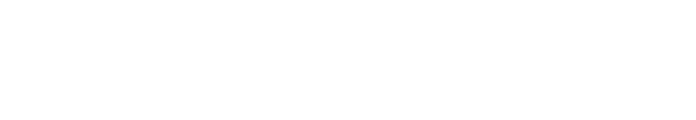

<p align="center">
  
</p>

<h3 align="center">
  Multi-platform CLI to download online course videos for offline viewing 🎬
  <br/>
  <sub>Lossless remux (-c copy) · Parallel downloads · Pluggable platform adapters</sub>
</h3>

<p align="center">
  <a href="LICENSE"></a>
  &nbsp;
  <a href="https://www.python.org/"></a>
  &nbsp;
  <a href="https://github.com/joaocaetanoramos/course-archiver/stargazers"></a>
  &nbsp;
  <a href="https://github.com/joaocaetanoramos/course-archiver/releases"></a>
</p>

---

## Table of contents

- [Why?](#why)
- [Features](#features)
- [Supported platforms](#supported-platforms)
- [Installation](#installation)
- [How to obtain the cookie](#how-to-obtain-the-cookie)
- [Usage](#usage)
  - [Quick start](#quick-start)
  - [All arguments](#all-arguments)
  - [Examples](#examples)
- [Output structure](#output-structure)
- [Architecture](#architecture)
  - [Module map](#module-map)
  - [Request flow](#request-flow)
  - [Adding a new platform](#adding-a-new-platform)
- [Performance tuning](#performance-tuning)
- [Troubleshooting & FAQ](#troubleshooting--faq)
- [Known limitations](#known-limitations)
- [Legal notice](#legal-notice)
- [Roadmap](#roadmap)
- [License](#license)

---

## Why?

Watching courses online requires a stable connection, and most platforms do not provide a built-in "download for offline" option. This tool fills that gap by downloading videos **you already have access to** (via your logged-in session cookie) to your local machine, organized in folders, with metadata, at maximum quality.

It is the same model as `yt-dlp --cookies-from-browser` or `Streamlink`, but with **automatic discovery** of every course/module/lesson from the cookie, multi-platform support, and built-in organization.

## Features

- 🎓 **Automatic course discovery** — point it at a dashboard/course URL and it walks the sidebar.
- 🌐 **Multi-platform** — pluggable adapters for Astron Members, Hotmart Club, Kiwify, Curseduca, plus a generic fallback.
- 🎥 **Multi-host video support** — Bunny Stream, PandaVideo, Scaleup (Smart Player), Hotmart AES-128 HLS, YouTube, direct m3u8 / mp4 — all routed through the same download path.
- ⚡ **Parallel downloads** — concurrent segment fetches per video (`--concurrent`) and concurrent lessons (`--parallel`).
- 🔁 **Resilient** — automatic retry with exponential backoff for transient network errors; auto-throttles `concurrent` when the server resets connections; auto-regenerates the cookie file on the rare "Netscape format" error.
- 📁 **Organized output** — `downloads/<group>/<course>/NN - Lesson X.Y.mp4` with embedded title/album/artist/comment metadata.
- 🪶 **Lossless** — direct remux (`-c copy`) to MP4. No re-encoding, no quality loss.
- 💻 **Clean CLI** — rich-powered progress bars (no overlap), colored status lines, per-chapter headers.

## Supported platforms

| Platform | Auto-discovery | Video download | Notes |
|---|---|---|---|
| **Astron Members** (`*.astronmembers.com`) | ✅ | ✅ Bunny / PandaVideo / Scaleup / YouTube | Full course + module + lesson discovery from the dashboard sidebar. |
| **Hotmart Club** (`*.hotmart.com`) | ✅ | ✅ HLS master m3u8 | AES-128 + separate audio track merged automatically. Requires fresh session cookie. |
| **Kiwify** (`*.kiwify.com`) | ✅ | ✅ HLS stream / direct download | May require a refresh token from localStorage. |
| **Curseduca** (`*.curseduca.pro`) | ⚠️ detection only | — | Lesson listing pending. |
| **Generic video URL** | — | ✅ via `yt-dlp` | Any m3u8 / mp4 / YouTube / Vimeo / Wistia link. |

> To request a new platform, open an issue or PR — see [Adding a new platform](#adding-a-new-platform).

## Installation

### Recommended: install as a CLI tool (run `course-archiver` from anywhere)

```bash
git clone https://github.com/joaocaetanoramos/course-archiver.git
cd course-archiver
pip install .
```

This installs the `course-archiver` command on your `PATH` (typically `~/.local/bin`), so you can run it from any directory:

```bash
course-archiver --cookies /path/to/cookie.txt "<COURSE_URL>"
```

Dependencies (Python packages + `ffmpeg`) are installed automatically.

### Alternative: run from source without installing

```bash
git clone https://github.com/joaocaetanoramos/course-archiver.git
cd course-archiver
pip install -r requirements.txt
python extrator.py --cookies cookie.txt "<COURSE_URL>"
```

### Requirements

- **Python 3.10+**
- **ffmpeg** (`sudo dnf install ffmpeg` / `brew install ffmpeg` / `apt install ffmpeg` / `pip install static-ffmpeg`)
- **pycryptodomex** (installed automatically via `pip install .` or `pip install -r requirements.txt`) — used for native AES-128 HLS decryption.

## How to obtain the cookie

The tool **requires** the cookie of your logged-in session. Authentication is your responsibility — the tool never embeds credentials.

1. **Install a cookie-export browser extension:**
   - **Chrome / Edge / Brave:** [Get cookies.txt LOCALLY](https://chromewebstore.google.com/detail/get-cookiestxt-locally/cclelndahbldhenkjhdlgphoegibknjl) or [Cookie-Editor](https://cookie-editor.com/)
   - **Firefox:** [cookies.txt](https://addons.mozilla.org/en-US/firefox/addon/cookies-txt/)
2. **Log in** to the course platform in your browser.
3. **Export the cookies** of that domain in **JSON** (Cookie-Editor) or **Netscape** format. The tool auto-detects both.
4. **Pass the file** to the tool:
   ```bash
   course-archiver --cookies ~/Downloads/cookies.json "<COURSE_URL>"
   ```

The tool also accepts a raw `Cookie:` header string (e.g., copied from DevTools) instead of a file.

> **Security:** the cookie file contains your session — treat it like a password. Do not share it. The `.gitignore` in this repo already excludes `cookie*.txt`.

## Usage

### Quick start

```bash
# Download a full course dashboard
course-archiver --cookies cookie.txt "<DASHBOARD_URL>"

# Download a specific course
course-archiver --cookies cookie.txt "<COURSE_URL>"

# Just list courses/lessons without downloading
course-archiver --cookies cookie.txt "<COURSE_URL>" --dry-run
```

### All arguments

| Flag | Description | Default |
|---|---|---|
| `url` | URL of the dashboard, course or lesson (positional, **required**) | — |
| `--cookies` `PATH` | Cookie file (JSON / Netscape) or raw `Cookie:` header (**required**) | — |
| `--output` `DIR` | Output directory | `./downloads` |
| `--parallel` `N` | Number of lessons downloaded concurrently | `1` |
| `--concurrent` `N` | HLS fragments downloaded in parallel **per video** | `8` |
| `--retries` `N` | Retries per lesson on transient network errors | `3` |
| `--dry-run` | List courses/lessons without downloading | `false` |
| `--course` `IDS` | Filter by course slug or id (comma-separated) | — |
| `--lesson` `IDS` | Filter by lesson id (comma-separated) | — |
| `--ffmpeg` `PATH` | Path to ffmpeg executable | auto-detect |

### Examples

```bash
# Conservative: one lesson at a time, slow but safe
course-archiver --cookies cookie.txt "<URL>" --parallel 1

# Fast: 4 lessons at once, 8 parallel segment fetches each
course-archiver --cookies cookie.txt "<URL>" --parallel 4 --concurrent 8

# Aggressive (use only if your connection and the server can handle it)
course-archiver --cookies cookie.txt "<URL>" --parallel 8 --concurrent 16

# Unstable network: more retries with backoff
course-archiver --cookies cookie.txt "<URL>" --retries 5

# Filter to one course
course-archiver --cookies cookie.txt "<URL>" --course my-course-slug

# Filter to specific lessons
course-archiver --cookies cookie.txt "<COURSE_URL>" --lesson 123,456,789
```

## Output structure

Files are organized by **group → course → lesson**:

```
downloads/
└── <Group Name>/
    └── <Course Name>/
        ├── 01 - Aula 1.1 - Introduction.mp4
        ├── 02 - Aula 1.2 - Concepts.mp4
        ├── 03 - Trilha: SUMMARY (sem vídeo)        # skipped (Trilha/track dividers)
        └── 04 - Aula 1.3 - Deep dive.mp4
```

Each `.mp4` has embedded metadata:

| Tag | Value |
|---|---|
| `title` | Lesson title |
| `album` | Course (module) name |
| `artist` | Group name |
| `comment` | Original lesson URL |

Lessons marked **"sem vídeo"** (`--dry-run` / live) are section/track dividers in the platform's sidebar (no actual video) and are skipped automatically.

## Architecture

### Module map

```
extrator.py          # CLI entry point (argparse), orchestration
lib/
  cookies.py         # Cookie loading: JSON / Netscape / raw Cookie header + TolerantSession (latin-1 redirect tolerance)
  platforms.py       # Pluggable platform adapters (detect / discover / list_lessons / extract_video)
  streams.py         # Resolves a video-host embed URL → master m3u8 URL (Bunny / PandaVideo / Scaleup / Hotmart / YouTube)
  downloader.py      # The actual download: yt-dlp native HLS, `concurrent_fragment_downloads`, `-c copy` remux, metadata tags
  progress.py        # Rich-based progress bars (one per video, stacked, no overlap)
```

### Request flow

```
+--------------------+
| 1. Parse URL & detect platform (lib/platforms.py)
|    (Astron / Hotmart / Kiwify / Curseduca / generic)
+----------+---------+
           |
           v
+--------------------+
| 2. Discover courses (platform.discover)
|    GET dashboard, parse sidebar <a href="curso/...">
+----------+---------+
           |
           v
+--------------------+
| 3. List lessons for each course (platform.list_lessons)
|    GET course page, parse module + lesson <a> tags
+----------+---------+
           |
           v
+--------------------+
| 4. Extract video embed URL per lesson (platform.extract_video)
|    GET lesson page, regex data-streaming-video / data-original-url
+----------+---------+
           |
           v
+--------------------+
| 5. Resolve embed → master m3u8 (lib/streams.py)
|    Bunny:  fetch embed page → regex vz-*.b-cdn.net/playlist.m3u8
|    Panda:  build b-{pullzone}.tv.pandavideo.com.br/{id}/playlist.m3u8
|    Scale:  fetch embed → meta hls-prefetch-url
|    Hotm:   fetch cf-embed → regex vod-akm.play.hotmart.com/.../master-pkg-*.m3u8
|    YT:     normalize /embed/{id} → /watch?v={id}
+----------+---------+
           |
           v
+--------------------+
| 6. Download via yt-dlp native (lib/downloader.py)
|    - cookiefile (auto-regenerated if "Netscape format" error)
|    - concurrent_fragment_downloads (auto-halved on ConnectionReset)
|    - retries=10, fragment_retries=10 (internal)
|    - AES-128 via pycryptodomex (native, parallel)
|    - remux to MP4 via ffmpeg -c copy + metadata tags
+----------+---------+
           |
           v
+--------------------+
| 7. Save to downloads/<group>/<course>/<NN> - <title>.mp4
+--------------------+
```

### Adding a new platform

To add support for a new platform (e.g., Udemy), implement an adapter in `lib/platforms.py`:

```python
class UdemyPlatform(Platform):
    name = "udemy"

    def detect(self, url):
        return "udemy.com" in urlparse(url).netloc

    def discover(self, url, session):
        # Return list of {"id", "title", "group", "slug", "url"}
        ...

    def list_lessons(self, course, session):
        # Return list of {"id", "title", "url", "group", "chapter"}
        ...

    def extract_video(self, lesson, session):
        # Return the embed URL (e.g., https://player.vimeo.com/... or direct m3u8)
        ...
```

Then register it in `PLATFORMS`:

```python
PLATFORMS = [AstronPlatform(), HotmartPlatform(), KiwifyPlatform(), CurseducaPlatform(), UdemyPlatform()]
```

The video resolution layer (`lib/streams.py`) is **shared** — if your platform serves a known host (Bunny / PandaVideo / Scaleup / Hotmart / YouTube), the stream is auto-resolved. If it uses a custom host, add a `resolve_yourhost` function in `streams.py`.

## Performance tuning

The two concurrency knobs are independent and serve different purposes:

| Knob | Scope | Recommendation |
|---|---|---|
| `--concurrent N` | HLS fragments downloaded **per video** in parallel (via yt-dlp's native HLS) | `8` is a good default. Higher = more bandwidth but more server stress. The tool **auto-halves** this on connection-reset errors. |
| `--parallel N` | Number of **lessons** downloaded concurrently (thread pool) | `1` (sequential) is safest. `2–4` is reasonable. `6+` risks triggering Cloudflare rate-limits. |

### Why "very large" videos trigger connection resets

A 30-minute 1080p video can have **300+ HLS segments**. With `concurrent_fragment_downloads: 8`, that's 8 parallel HTTP connections per video. With `--parallel 6`, you can hit **48 concurrent connections** to the same CDN host. Cloudflare's per-IP connection limits and rate-limits start kicking in, and it begins resetting connections mid-download.

The tool's defenses:
- `--concurrent 8` default (not higher).
- **Adaptive throttling**: on every `ConnectionResetError`, the tool **halves `concurrent`** automatically and shows a warning. Subsequent videos use the reduced value.
- **Retry with exponential backoff + jitter** (2s, 4s, 8s, capped at 30s) — `ConnectionResetError`, `ReadTimeout`, etc. are caught and retried up to `--retries` times.
- **yt-dlp internal retries**: `retries: 10`, `fragment_retries: 10` so individual segment failures retry inside yt-dlp before bubbling up.

### Recommended settings by network / server

| Scenario | `--parallel` | `--concurrent` | `--retries` |
|---|---|---|---|
| Stable, fast connection | `4` | `8` | `3` |
| Unstable / mobile | `2` | `4` | `5` |
| Server rate-limits aggressively | `1` | `2` (let it auto-throttle) | `5` |
| Large downloads (>1 GB each) | `2` | `4` | `5` |

## Troubleshooting & FAQ

### "ERROR: '/tmp/cookies_...txt' does not look like a Netscape format cookies file"

The cookie file was valid at startup but became unreadable mid-run (rare filesystem glitch). **The tool auto-detects this and regenerates the file from the in-memory jar, then retries.** If it still fails, your cookie is likely expired — re-export it from the browser.

### Connection reset / timeout mid-download

The tool **automatically retries** with exponential backoff (2s → 4s → 8s, capped at 30s, plus jitter). It also **halves `concurrent`** after the first reset, so subsequent videos use fewer parallel segment connections. Just re-run the tool — lessons that succeeded are skipped (resume), only the failed ones retry.

### A lesson shows "sem vídeo" (no video)

The platform's sidebar may include section dividers ("Trilha: …", "Nota de atualização", etc.) that have no actual video. These are **skipped automatically**. If a real lesson shows "sem vídeo", the page returned no `data-streaming-video` — usually a transient rate-limit or an auth issue.

### ffmpeg not found

Install it: `sudo dnf install ffmpeg` / `brew install ffmpeg` / `apt install ffmpeg`. The tool auto-detects via `shutil.which('ffmpeg')`. If it's in a non-standard location, pass `--ffmpeg /path/to/ffmpeg`.

### Lesson download is huge / slow

For 1-hour+ 1080p videos, expect 1–3 GB files. The download speed is bounded by:
1. Your connection bandwidth.
2. The CDN's per-connection speed limit (Cloudflare often caps per-connection).
3. Your `--concurrent` setting (more segments = more bandwidth, up to your ceiling).

Reduce `--concurrent` to 2 or 4 if downloads are timing out mid-way on large files.

### Resume support

The tool **skips** lessons whose output `.mp4` already exists (checked by file path). If a run is interrupted (Ctrl+C), re-run the same command — completed lessons are skipped, failed ones retry.

### Curseduca lessons aren't listed

Curseduca lesson discovery is **not yet implemented** (see [ROADMAP.md](ROADMAP.md)). The tool detects the platform but prints a clear error. Workaround: extract the lesson IDs from `clas.curseduca.pro/contents/{id}` manually.

### Kiwify: "token de autenticação não encontrado"

Kiwify's auth uses a Firebase JWT (`id_token` / `access_token` / `refresh_token`) that lives in **localStorage**, not in cookies. Export the cookie file *and* include those tokens (Cookie-Editor can export them as `__session` cookies, or extract them from DevTools → Application → Local Storage). See the platform's notes in `ROADMAP.md`.

## Known limitations

- **HLS `.dts` extension (Bunny Stream)**: handled natively by yt-dlp, no issue.
- **Separate audio tracks (Scaleup, Hotmart)**: yt-dlp merges automatically with `bestvideo+bestaudio`.
- **DRM-protected content**: not supported (the tool only handles the video URLs returned by the platform's player, not DRM-encrypted streams).
- **Login required**: the tool does not bypass authentication. A valid cookie from your logged-in session is always required.
- **Curseduca**: lesson listing not yet implemented (see ROADMAP).
- **Live streams**: not tested; yt-dlp supports them but the tool assumes VOD (`.endswith('.m3u8')` / master playlist).

## Legal notice

**Use this tool only to download content you have purchased and have the right to access**, for personal offline use (travel, poor connection, accessibility).

- ❌ Do **not** redistribute the downloaded material.
- ❌ Do **not** use it to access unauthorized content.
- ❌ Do **not** share your cookies.

You are solely responsible for the use you make of the tool. The authors are not responsible for misuse.

## Roadmap

See [ROADMAP.md](ROADMAP.md) for planned features (Chrome extension, supplementary materials, more adapters, packaging).

## License

MIT — see [LICENSE](LICENSE).

## Disclaimer

This tool is not affiliated with any of the supported platforms. It is an independent personal-utility project.

---

🇧🇷 **Versão em português:** [README.pt-BR.md](README.pt-BR.md)
